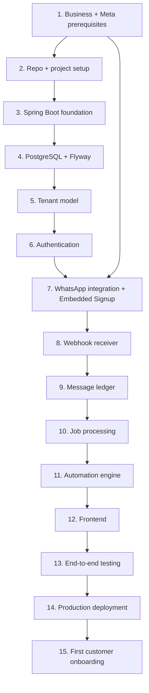

# Development Roadmap — The Exact Build Order

This is the **sequence**. `02-ACTIONS/MASTER-ACTION-PLAN.md` is the **detail**.
Use this file to know *where you are*; use the action plan to know *what to type*.

Steps are ordered by dependency, not by interest. Do not skip ahead — Step 7 will fail
without Step 5, and Step 15 will fail without Step 1.

---

## Overview



**Critical path note:** Step 1 has a 1–3 week external wait (Meta verification and App
Review). Start it on day one and do Steps 2–6 *while waiting*. Do not sit idle.

---

## STEP 1 — Business and Meta prerequisites

**What to do**
Register the domain. Register/confirm the business entity. Complete Meta Business
Verification. Apply for Tech Provider status and submit App Review for
`whatsapp_business_management` and `whatsapp_business_messaging` with **Advanced Access**.
Create the Oracle Cloud account with home region **Mumbai or Hyderabad**.

**Why**
Everything downstream is blocked on Meta approval, and it is the only task with a
multi-week external dependency. Without Advanced Access, Embedded Signup completes but
your app cannot manage the customer's WABA afterwards — the entire Tech Provider model
fails. The Oracle home region is **irreversible**.

**Expected output**
- Domain registered with valid SSL capability
- Meta Business Portfolio verified
- Tech Provider onboarding submitted; App Review in progress or approved
- Oracle tenancy in an Indian region with a confirmed 2 OCPU / 12 GB ARM instance

**Read**
`02-ACTIONS/PRE-DEVELOPMENT-CHECKLIST.md`, `08-META-WHATSAPP/META-BUSINESS-SETUP.md`,
`08-META-WHATSAPP/TECH-PROVIDER-SETUP.md`, `07-INFRASTRUCTURE/ORACLE-CLOUD-SETUP.md`

**Files/code that should exist**
None. This step is entirely administrative.

**Definition of Done**
- [ ] Domain resolves and you control DNS
- [ ] Meta Business Verification shows **Verified**
- [ ] App Review submitted (approval may still be pending — that's fine, continue to Step 2)
- [ ] You have successfully provisioned an ARM instance in Mumbai or Hyderabad
- [ ] Business entity documents are on file (needed for Razorpay too)

---

## STEP 2 — Repository and project setup

**What to do**
Create a private Git repo. Generate a Spring Boot 3.x project (Java 21, Maven or Gradle)
with: Web, Validation, Data JPA, PostgreSQL driver, Flyway, Security, Actuator.
Set up `.gitignore`, a `README`, and local dev config.

**Why**
A clean foundation prevents the most common early mess: secrets committed to Git and
schema drift.

**Expected output**
A repo that builds and runs locally with `./mvnw spring-boot:run`.

**Read** `05-BACKEND/BACKEND-SETUP.md`

**Files/code**
```text
pom.xml (or build.gradle)
src/main/java/com/<you>/wasaas/Application.java
src/main/resources/application.yml
src/main/resources/application-local.yml
.gitignore   .env.example   README.md
```

**Definition of Done**
- [ ] `./mvnw clean verify` passes
- [ ] App starts on port 8080
- [ ] No secrets anywhere in Git history
- [ ] `.env.example` documents every required variable

---

## STEP 3 — Spring Boot foundation

**What to do**
Create the module package structure. Add global exception handling, a standard API error
response shape, request-ID logging (MDC), and Actuator health/info endpoints.

**Why**
Establishing module boundaries *before* writing features is the entire reason a modular
monolith stays modular. Retrofitting boundaries never happens.

**Expected output** Empty but correctly-bounded module packages, and consistent errors.

**Read** `05-BACKEND/SPRING-BOOT-STRUCTURE.md`, `05-BACKEND/MODULES.md`, `05-BACKEND/API-DESIGN.md`

**Files/code**
```text
common/exception/GlobalExceptionHandler.java, ApiError.java, DomainException.java
common/logging/RequestIdFilter.java
tenant/  user/  auth/  whatsapp/  messaging/  template/  automation/
job/  ledger/  inbox/  analytics/     (packages, mostly empty)
```

**Definition of Done**
- [ ] `GET /actuator/health` returns 200
- [ ] A thrown `DomainException` produces a consistent JSON error body
- [ ] Every log line carries a request ID
- [ ] Package structure matches `MODULES.md`

---

## STEP 4 — PostgreSQL and Flyway

**What to do**
Run Postgres 17 locally (Docker is fine for local only). Write migration `V1__baseline.sql`.
Confirm Flyway runs on startup. Add `pgcrypto`.

**Why**
Schema-as-code from commit #1. Golden Rule 9.

**Expected output** A versioned schema that applies cleanly to an empty database.

**Read** `04-DATABASE/DATABASE-MIGRATIONS.md`, `07-INFRASTRUCTURE/POSTGRES-SETUP.md`

**Files/code** `src/main/resources/db/migration/V1__baseline.sql`

**Definition of Done**
- [ ] Flyway applies V1 to a fresh DB with no errors
- [ ] `flyway_schema_history` shows the migration
- [ ] Dropping and recreating the DB reproduces the schema exactly

---

## STEP 5 — Tenant model

**What to do**
Create `tenants`, `users`, `tenant_users`. Implement `TenantContext` (request-scoped),
a filter that populates it, and repository-level enforcement. Enable Row-Level Security
as a second net.

**Why**
This is the single most expensive thing to retrofit and the single most damaging thing to
get wrong. Golden Rule 3.

**Expected output** Two tenants can coexist and provably cannot see each other's rows.

**Read** `03-ARCHITECTURE/MULTI-TENANCY.md`, `04-DATABASE/MULTI-TENANT-DATABASE-RULES.md`

**Files/code**
```text
tenant/Tenant.java, TenantRepository.java, TenantService.java
tenant/context/TenantContext.java, TenantContextFilter.java
user/User.java, TenantUser.java
db/migration/V2__tenants_users.sql
```

**Definition of Done**
- [ ] `TenantContext` is populated for every authenticated request
- [ ] A test proves Tenant A cannot read Tenant B's rows **via the repository layer**
- [ ] A test proves the same **with RLS**, even given a raw query missing `tenant_id`
- [ ] Every table created so far has a non-null `tenant_id` (except `tenants` and `users`)

---

## STEP 6 — Authentication

**What to do**
Spring Security with Argon2id password hashing, Spring Session JDBC (server-side sessions
in Postgres), login/logout, password reset via email, and role checks within a tenant.

**Why**
Self-implemented per ADR — no per-MAU vendor bill, no migration later. Sessions in
Postgres keep the app stateless (Golden Rule 8).

**Expected output** A user can register a tenant, log in, and hit a protected endpoint.

**Read** `03-ARCHITECTURE/AUTHENTICATION-AND-AUTHORIZATION.md`, `03-ARCHITECTURE/SECURITY.md`

**Files/code**
```text
auth/SecurityConfig.java, AuthController.java, AuthService.java
auth/PasswordResetService.java
db/migration/V3__spring_session.sql
```

**Definition of Done**
- [ ] Registration creates a tenant + owner user atomically
- [ ] Login issues an HttpOnly, Secure, SameSite session cookie
- [ ] Passwords stored with Argon2id; never logged
- [ ] Password reset tokens are single-use and expire
- [ ] Sessions survive an application restart

---

## STEP 7 — WhatsApp integration and Embedded Signup

**What to do**
Implement the Embedded Signup callback: exchange the returned code for a business token,
fetch WABA ID and phone number ID, subscribe your app to the WABA's webhooks, store the
token **encrypted**. Build the outbound send client.

**Why**
This is the core of the Tech Provider model. The customer owns the WABA; we hold a scoped
token to operate it. Meta bills them directly.

**Expected output** You can connect your *own* test business end-to-end and send a message.

**Read** `03-ARCHITECTURE/WHATSAPP-INTEGRATION.md`, `08-META-WHATSAPP/EMBEDDED-SIGNUP.md`,
`05-BACKEND/WHATSAPP-SERVICE.md`

**Files/code**
```text
whatsapp/WhatsAppAccount.java, WhatsAppAccountRepository.java
whatsapp/EmbeddedSignupService.java, TokenExchangeService.java
whatsapp/client/WhatsAppCloudClient.java, dto/*
whatsapp/crypto/TokenCipher.java
db/migration/V4__whatsapp_accounts.sql
```

**Definition of Done**
- [ ] Embedded Signup completes and persists WABA ID + phone number ID + encrypted token
- [ ] App is subscribed to the WABA's webhook fields
- [ ] A text message sends successfully to your own number
- [ ] Token is unreadable in the database without the application key
- [ ] Token never appears in any log, response body, or exception message

**⚠️ Blocked on** Step 1 App Review approval for Advanced Access.

---

## STEP 8 — Webhook receiver

**What to do**
`GET` verification endpoint (hub challenge) and `POST` receiver. Verify
`X-Hub-Signature-256`. Persist the raw event. **ACK within 2 seconds.** Enqueue for async
processing. Deduplicate by event/message ID.

**Why**
Meta retries on non-200 or slow responses, and repeatedly-failing endpoints get disabled.
Golden Rule 4.

**Expected output** Inbound messages and status callbacks land in the DB, fast.

**Read** `03-ARCHITECTURE/WEBHOOK-ARCHITECTURE.md`, `05-BACKEND/WEBHOOK-IMPLEMENTATION.md`

**Files/code**
```text
whatsapp/webhook/WebhookController.java, SignatureVerifier.java
whatsapp/webhook/WebhookEventRepository.java, WebhookIngestService.java
db/migration/V5__webhook_events.sql
```

**Definition of Done**
- [ ] Meta's verification handshake succeeds
- [ ] Invalid signature → 403, and the payload is not processed
- [ ] p99 response time under 2s (measure it)
- [ ] The same event delivered twice creates exactly one logical effect
- [ ] Zero business logic and zero outbound API calls inside the controller

---

## STEP 9 — Message ledger

**What to do**
Append-only `message_ledger`. Every outbound send and every inbound message and status
webhook, tagged with billing category (marketing/utility/authentication/service), Meta's
`wamid`, timestamps, and status transitions.

**Why**
This is your billing evidence, delivery-dispute answer, and — after 1 October 2026 — the
only way to explain a customer's Meta invoice. Retrofitting it is painful.

**Expected output** A queryable, immutable history of every message per tenant.

**Read** `03-ARCHITECTURE/MESSAGE-LEDGER.md`, `05-BACKEND/BILLING-LEDGER.md`,
`08-META-WHATSAPP/OCTOBER-2026-BILLING-CHANGE.md`

**Files/code**
```text
ledger/MessageLedgerEntry.java, MessageLedgerRepository.java, LedgerService.java
ledger/BillingCategory.java (enum)
db/migration/V6__message_ledger.sql
```

**Definition of Done**
- [ ] Every send writes a ledger row **before** the API call
- [ ] Status webhooks append transitions; they never `UPDATE` in place
- [ ] Per-tenant per-category monthly counts are a single indexed query
- [ ] `wamid` is stored and unique per tenant

---

## STEP 10 — Job processing

**What to do**
`jobs` table + a worker polling with `FOR UPDATE SKIP LOCKED`. Exponential backoff,
retry limits, dead-letter status, idempotency keys. Run as `profile=worker` — same JAR.

**Why**
Durable async work using only Postgres. No Redis, no broker (ADR-002). The web/worker
profile split is what makes horizontal scaling later a config change.

**Expected output** Enqueued work survives restarts, retries on failure, and never
double-sends.

**Read** `03-ARCHITECTURE/BACKGROUND-JOBS.md`, `05-BACKEND/JOB-PROCESSING.md`,
`05-BACKEND/ERROR-HANDLING-AND-RETRY.md`

**Files/code**
```text
job/Job.java, JobRepository.java, JobService.java, JobStatus.java
job/JobWorker.java, JobHandler.java (interface)
job/handler/SendWhatsAppMessageHandler.java, ProcessInboundMessageHandler.java
db/migration/V7__jobs.sql
```

**Definition of Done**
- [ ] Killing the app mid-job leaves the job re-claimable, not lost
- [ ] Two workers running concurrently never process the same job
- [ ] A permanently-failing job lands in dead-letter after N attempts, not infinite retry
- [ ] Re-running a job with the same idempotency key does not send twice
- [ ] The app runs correctly with `--spring.profiles.active=worker`

---

## STEP 11 — Automation engine

**What to do**
Deterministic rules: keyword/pattern matching, FAQ lookup via Postgres full-text +
`pg_trgm`, interactive button/list replies, scheduled utility templates, and an
escalation flag for unmatched messages.

**Why**
No AI in the core path (ADR-007). Debuggable, zero latency variance, no hallucinated
prices. Log every unmatched message — that data tells you whether AI is ever needed.

**⚠️ `[DECISION REQUIRED]`** The exact automation feature set is **not** specified in the
source document. See `13-DECISIONS/DECISIONS.md` D-01. Do not start this step until D-01
is closed.

**Expected output** An inbound message produces a correct automated reply, or escalates.

**Read** `05-BACKEND/TEMPLATE-SERVICE.md`, `05-BACKEND/SCHEDULING.md`,
`06-FRONTEND/AUTOMATION-CONFIGURATION.md`

**Definition of Done**
- [ ] A configured keyword triggers the right reply
- [ ] FAQ matching returns sensible results above a confidence threshold
- [ ] Below threshold → escalate, never guess
- [ ] Multi-part replies are consolidated into one message where possible (cost)
- [ ] Every unmatched inbound message is logged for later analysis

---

## STEP 12 — Frontend

**What to do**
React + Vite SPA. MVP screens only: Login, Dashboard, WhatsApp Connection, Automation,
FAQ, Templates, Inbox, Settings.

**Why** Customers need a self-serve surface. Nothing more than that yet.

**Read** `06-FRONTEND/FRONTEND-SETUP.md`, `06-FRONTEND/APPLICATION-SCREENS.md`,
`06-FRONTEND/USER-FLOWS.md`

**Definition of Done**
- [ ] All eight screens exist with empty, loading, error and success states
- [ ] Embedded Signup popup launches and completes from the UI
- [ ] Per-tenant message counts visible (needed before October)
- [ ] Builds and deploys to Cloudflare Pages
- [ ] No secrets in frontend bundle

---

## STEP 13 — End-to-end testing

**What to do**
Multi-tenancy isolation tests, duplicate-webhook tests, retry/failure tests, token
encryption tests, and a full inbound→reply flow with a mocked Meta API.

**Read** `09-TESTING/TESTING-STRATEGY.md`, `09-TESTING/MULTI-TENANCY-TESTING.md`,
`09-TESTING/PRE-PRODUCTION-CHECKLIST.md`

**Definition of Done**
- [ ] Every test case in `09-TESTING/` marked BUILD NOW passes
- [ ] Testcontainers Postgres used for integration tests (not H2)
- [ ] Cross-tenant access test **fails closed** when RLS is disabled — proving RLS is doing work

---

## STEP 14 — Production deployment

**What to do**
Provision the Oracle VM via script. Caddy + TLS. Postgres. systemd services for web and
worker. Nightly backups to Backblaze B2. Sentry, Better Stack, Grafana Cloud. GitHub
Actions deploy. **Then test the restore.**

**Read** `07-INFRASTRUCTURE/PRODUCTION-DEPLOYMENT.md`, `07-INFRASTRUCTURE/BACKUP-SETUP.md`,
`10-OPERATIONS/BACKUP-RESTORE-PROCEDURE.md`

**Definition of Done**
- [ ] HTTPS works on your real domain with a valid certificate
- [ ] Meta webhooks reach production successfully
- [ ] `systemd` restarts both services automatically after reboot
- [ ] A backup exists in B2 **and you have restored it to a scratch DB successfully**
- [ ] Better Stack alerts you within 3 minutes of the app going down (test by stopping it)
- [ ] The provisioning script can rebuild the whole box from scratch in under an hour

---

## STEP 15 — First customer onboarding

**What to do**
Onboard customer #1 **manually, on a video call**. Walk them through Embedded Signup,
payment-method attachment on Meta, template creation, and a test message.

**Why**
This is your highest-value learning channel. Automating onboarding before doing it 20
times means automating the wrong thing.

**Read** `10-OPERATIONS/CUSTOMER-ONBOARDING.md`, `02-ACTIONS/FIRST-10-CUSTOMERS.md`

**Definition of Done**
- [ ] Customer's own WABA connected, owned by them
- [ ] **Their** payment method attached to Meta — verify this explicitly
- [ ] At least one template approved
- [ ] A real message sent to a real customer of theirs
- [ ] They are paying you via Razorpay
- [ ] You wrote down every point of confusion during the call

---

## After Step 15

Go to `02-ACTIONS/FIRST-10-CUSTOMERS.md`, then `FIRST-20-CUSTOMERS.md`.
**Do not start building new infrastructure.** Re-read Golden Rules 1 and 2.
Infrastructure spend decisions live in `12-SCALING/REVENUE-FUNDED-INFRASTRUCTURE.md`.
