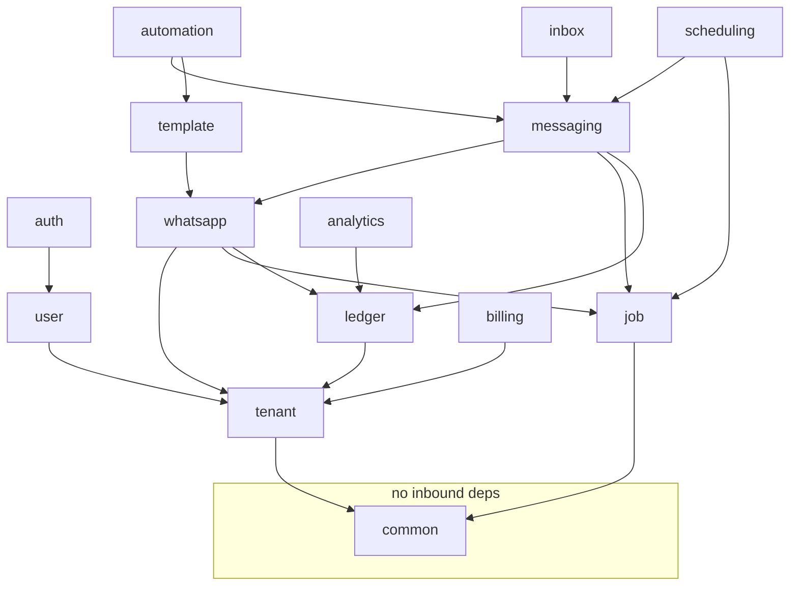

# Application Structure

**Classification: BUILD NOW (increment F03).** Detailed module contracts in `05-BACKEND/MODULES.md`.

## Package layout — by feature, not by layer

```text
com.example.wasaas
│
├── Application.java
│
├── common/                        shared, depends on nothing
│   ├── exception/                 DomainException, NotFoundException, ApiError,
│   │                              GlobalExceptionHandler, PermanentJobException
│   ├── logging/                   RequestIdFilter (MDC), LogScrubber
│   ├── config/                    Jackson, async, OpenAPI, rate-limit config
│   └── util/                      PhoneNumbers (E.164 + hashing), Ids, Clock
│
├── tenant/
│   ├── Tenant.java  TenantRepository  TenantService
│   ├── TenantController.java
│   └── context/                   TenantContext, TenantContextFilter, TenantAwareDataSource
│
├── user/                          User, TenantUser, repositories, UserService
│
├── auth/                          SecurityConfig, AuthController, AuthService,
│                                  PasswordResetService, LoginRateLimiter
│
├── whatsapp/                      ← the integration boundary
│   ├── WhatsAppAccount.java  WhatsAppAccountRepository  WhatsAppAccountService
│   ├── signup/                    EmbeddedSignupService, TokenExchangeService
│   ├── client/                    MetaGraphClient, WhatsAppCloudClient, dto/
│   ├── crypto/                    TokenCipher
│   └── webhook/                   WebhookController, SignatureVerifier,
│                                  WebhookEvent, WebhookIngestService
│
├── messaging/                     MessagingService (the ONLY public send entry point),
│                                  Contact, Conversation, repositories,
│                                  InboundMessageProcessor
│
├── template/                      WhatsAppTemplate, TemplateService, TemplateSyncService
│
├── automation/                    AutomationRule, AutomationEngine, RuleMatcher,
│                                  Faq, FaqMatchService, EscalationService
│
├── scheduling/                    ScheduledMessage, SchedulingService
│
├── job/                           Job, JobRepository, JobService, JobWorker,
│   └── handler/                   JobHandler impls (one per job type)
│
├── ledger/                        MessageLedgerEntry, StatusEvent, LedgerService,
│                                  BillingCategory, WhatsAppRate
│
├── billing/                       Subscription, RazorpayClient, BillingWebhookController,
│                                  SubscriptionService
│
├── inbox/                         InboxController, InboxQueryService (read-mostly)
│
└── analytics/                     AnalyticsController, MessageCountQueryService (read-only)
```

**Why by feature:** when you're fixing a webhook bug you open one package, not four. And when
you eventually want to extract something, a feature package is extractable; a layer package is not.

---

## Dependency rules — enforce these



| Rule | Detail |
|---|---|
| `common` depends on nothing | If `common` imports a feature package, the design has broken |
| No cycles | `automation → messaging` is allowed; `messaging → automation` is not. Use a Spring event instead. |
| Cross-module access via public service interfaces only | Never another module's repository or entity |
| **Only `job.handler` may call `WhatsAppCloudClient`** | Enforces "no synchronous sends". Consider an ArchUnit test for this. |
| `MessagingService` is the only public send entry | Everything else enqueues through it |
| `inbox` and `analytics` are read-mostly | They query; they don't mutate domain state |

Two ways to make this real rather than aspirational:
- **Spring Modulith** — declares module boundaries and verifies them in a test
- **ArchUnit** — a handful of rules covering the table above

Either is ~1 hour of work and stops the slow decay that otherwise happens by month three.

---

## Layer conventions within a module

```text
XxxController      REST, DTOs in/out, no business logic, no @Transactional
XxxService         business logic, @Transactional, orchestration
XxxRepository      Spring Data JPA, tenant-scoped
Xxx (entity)       JPA entity — never returned from a controller
XxxRequest/Response  records at the API boundary
XxxEvent           Spring application events for cross-module signals
```

Rules:
- **Constructor injection only.** No `@Autowired` fields — they hide dependencies and break tests.
- **`@Transactional` on services**, not controllers (too wide) or repositories (too narrow).
- **Never expose JPA entities in API responses.** Lazy-loading exceptions during serialisation,
  accidental field leaks, and coupling your API to your schema. Map to records.
- **Custom exceptions extend `DomainException`**; `GlobalExceptionHandler` maps them to `ApiError`.

## Error response shape

```java
public record ApiError(
    String  code,        // "TENANT_SLUG_TAKEN"  — stable, machine-readable
    String  message,     // human-readable, safe to display
    String  requestId,   // from MDC — matches your logs
    Instant timestamp,
    Map<String, String> fieldErrors   // for validation failures
) {}
```

Returning `requestId` means a customer can quote it and you can find the exact log line. Small
thing, disproportionate support value.

## Configuration

`application.yml` with env-var placeholders and local defaults. Profiles: `local`, `web`, `worker`.

```yaml
spring:
  jpa:
    hibernate:
      ddl-auto: validate     # NEVER update or create — Flyway owns the schema
```

Typed config via `@ConfigurationProperties` records, not scattered `@Value` annotations.

## Testing structure

```text
src/test/java/.../
├── unit/            plain JUnit + Mockito, no Spring context
├── integration/     @SpringBootTest + Testcontainers Postgres
└── architecture/    ArchUnit / Modulith boundary tests
```

**Testcontainers, never H2.** We depend on real Postgres behaviour: `FOR UPDATE SKIP LOCKED`,
Row-Level Security, `pg_trgm`, `tsvector`, `jsonb`. H2 would give you passing tests and a broken
production.

**And connect as the non-superuser app role in tests** — Testcontainers defaults to superuser,
which bypasses RLS and makes every isolation test pass for the wrong reason.
