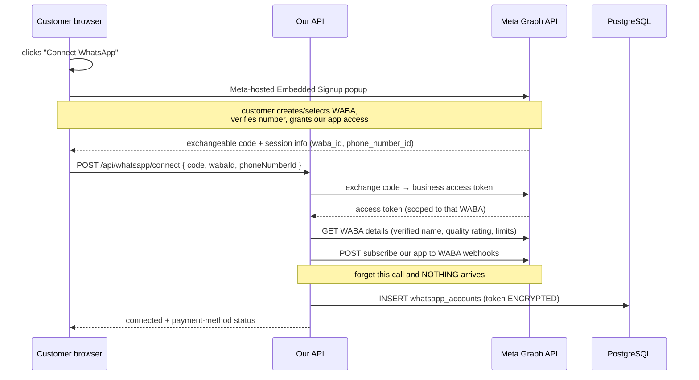

# Data Flow

**Classification: BUILD NOW.** The five flows that matter.

## 1. Customer onboarding (Embedded Signup)



**The customer must then attach a payment method on Meta's side.** We cannot do it for them,
and messages fail without it. This is the most common onboarding failure — hence the prominent
warning in F18.

## 2. Inbound message → automated reply

```text
End customer sends WhatsApp message
    │
    ▼
Meta → POST /api/webhooks/whatsapp
    │ verify signature (raw bytes, constant time)
    │ INSERT webhook_events (raw)
    │ INSERT jobs (PROCESS_WEBHOOK_EVENT, key = wh:{event_id})
    │ 200 OK  ◄── under 2 seconds
    ▼
Worker claims job (SKIP LOCKED)
    │ resolve tenant from phone_number_id
    │ upsert contacts
    │ upsert conversations, service_window_expires_at = msg_ts + 24h
    │ INSERT message_ledger (INBOUND_FREE)
    │ publish InboundMessageReceived
    ▼
AutomationEngine
    │ 1. keyword rules, by priority — FIRST MATCH WINS
    │ 2. no match → FAQ (full-text + trigram), if confidence ≥ threshold
    │ 3. still no match → ESCALATE + log unmatched
    │ check per-contact reply rate limit  ◄── prevents spending customer money in a loop
    ▼
MessagingService.send(...)   ← enqueues, never calls Meta directly
    │ INSERT jobs (SEND_WHATSAPP_MESSAGE, key = reply:{wamid}:{ruleId})
    ▼
Worker → SendMessageJobHandler
    │ 1. INSERT message_ledger (intent)         ◄── BEFORE the API call
    │ 2. POST Meta /messages
    │ 3. attach wamid to ledger row
    ▼
Meta delivers · status webhooks (sent → delivered → read)
    │
    ▼
append message_ledger_status_events
```

## 3. Scheduled message

```text
User schedules a template for a future time (stored UTC + tenant timezone)
    │
    ▼
Every minute: ENQUEUE_DUE_SCHEDULED_MESSAGES job
    │ claim scheduled_messages WHERE status='SCHEDULED' AND scheduled_for <= now()
    │ mark ENQUEUED
    │ INSERT jobs (SEND_WHATSAPP_MESSAGE, key = sched:{id})   ◄── deterministic key
    ▼
Same send path as flow 2
```

The deterministic key means a double-run of the scheduler — or a crash and retry — cannot
double-send. This is a correctness requirement: a duplicate costs the customer money.

## 4. Delivery status

```text
Meta status webhook  →  same receiver, same fast ACK
    │
    ▼
Worker: find message_ledger by (tenant_id, wamid)
    │ INSERT message_ledger_status_events (append)
    │ UPDATE message_ledger.status  ← the ONLY permitted update on this table
    ▼
Visible in Inbox and Dashboard
```

`failed` statuses carry a Meta error code. Translate common ones into plain language for the
customer — "the recipient's number is not on WhatsApp" beats "error 131026".

## 5. Subscription billing

```text
Customer subscribes  →  Razorpay checkout (UPI preferred, 0% MDR under ₹2,000)
    │
    ▼
Razorpay webhook  →  verify signature, persist raw, enqueue, ACK
    │
    ▼
Worker updates subscriptions state machine
    │ TRIALING → ACTIVE → (PAST_DUE) → CANCELLED / EXPIRED
    ▼
PAST_DUE → block outbound sends
           NEVER block login, data access, or export
```

**State changes come only from verified webhooks**, never from a client callback. A browser
saying "payment succeeded" is not evidence.

---

## Where data lives

| Data | Store | Notes |
|---|---|---|
| Tenants, users, config | PostgreSQL | — |
| WhatsApp tokens | PostgreSQL, AES-256-GCM | Key in env, not in DB |
| Raw webhook events | PostgreSQL `jsonb` | Append-only; replay source |
| Message ledger | PostgreSQL | Append-only; billing truth |
| Full phone numbers | `contacts` only | Ledger stores hash + last4 |
| Sessions | PostgreSQL (Spring Session JDBC) | Keeps app stateless |
| Jobs | PostgreSQL | The queue |
| Media files | Cloudflare R2 | Zero egress |
| Backups | Backblaze B2, encrypted | Different vendor from Oracle |
| Logs | stdout → journald; errors → Sentry | Scrubbed |
