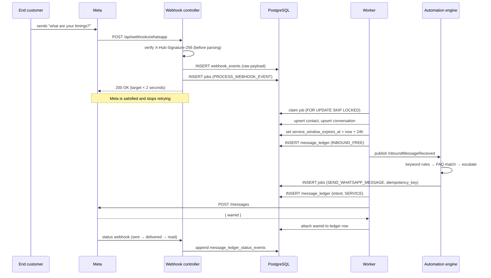

# System Architecture

**Classification: BUILD NOW** — this is the MVP architecture in full.

## The whole system

```text
Customer's browser (React SPA)
        │ HTTPS
        ▼
Cloudflare  ──── DNS · CDN · WAF · free SSL
        │
        ▼
Caddy (on the VM)  ──── auto-TLS via Let's Encrypt, reverse proxy
        │
        ▼
┌─────────────────────────────────────────────────────────┐
│  ONE Oracle Always Free VM — 2 OCPU / 12 GB ARM         │
│                                                          │
│  Spring Boot JAR, profile=web        (systemd)           │
│    ├── REST API for the SPA                              │
│    └── Webhook receiver ── ACK <2s, persist + enqueue    │
│                                                          │
│  Spring Boot JAR, profile=worker     (systemd)           │
│    └── Job poller ── FOR UPDATE SKIP LOCKED              │
│                                                          │
│  PostgreSQL 17 (localhost only, non-superuser app role)  │
│    ├── tenants, users, tenant_users                      │
│    ├── whatsapp_accounts (tokens encrypted)              │
│    ├── jobs               ← the queue                    │
│    ├── webhook_events     ← raw inbound, append-only     │
│    ├── message_ledger     ← billing truth, append-only   │
│    ├── contacts, conversations                           │
│    └── templates, automation_rules, faqs, scheduled_msgs  │
└─────────────────────────────────────────────────────────┘
        │                                    │
        ▼                                    ▼
WhatsApp Cloud API                    Backblaze B2
(billed to CUSTOMER's WABA)           (encrypted nightly backups)

Cloudflare R2 — media files (10 GB free, zero egress)
Sentry · Better Stack · Grafana Cloud — observability
```

**Same JAR, two profiles.** This is the most important structural choice. `web` serves HTTP;
`worker` polls jobs. One artifact, one codebase, two systemd units. When you eventually need
to scale the message pipeline, you run more worker processes — a config change, not a rewrite.

---

## Every component, and why

| Component | Choice | Why this, not the alternative |
|---|---|---|
| Frontend host | Cloudflare Pages | Unlimited bandwidth on free tier; Netlify/Vercel cap at 100–125 GB/month |
| Edge | Cloudflare | Free DNS + CDN + WAF + DDoS; one account covers Pages and R2 too |
| TLS / proxy | Caddy | Automatic Let's Encrypt with a 5-line config. nginx needs certbot plumbing. |
| Compute | Oracle Always Free ARM | The only genuinely free always-on compute at this size. Fly.io and Heroku free tiers are gone; Render free spins down. |
| Runtime | Java 21 + Spring Boot 3.x | Your existing expertise. Boring is a feature. |
| Database | Self-hosted Postgres 17 | See ADR-006 — managed free tiers can't do always-on |
| Queue | Postgres `SKIP LOCKED` | See ADR-002 — transactional enqueue, no new service |
| Cache | Caffeine (in-process) | Single instance; nothing is cross-instance yet |
| Sessions | Spring Session JDBC | Keeps the app stateless without Redis |
| Object storage | Cloudflare R2 | Zero egress fees; S3-compatible |
| Backups | Backblaze B2 | **Different vendor from Oracle** — never back up a provider to itself |
| Errors | Sentry (5k/mo free) | — |
| Uptime | Better Stack (10 monitors free) | UptimeRobot's free plan is personal/non-commercial only since Dec 2024 |
| CI/CD | GitHub Actions | 2,000 min/mo ≈ 600 JAR builds |

---

## What happens when a WhatsApp message arrives



**The critical property:** the webhook controller does *nothing* except verify, persist, and
enqueue. All real work happens in the worker. This is why a slow Meta API or a bug in the
automation engine can never cause Meta to disable our webhook.

---

## What happens when the application crashes

| Crash point | Result |
|---|---|
| Before the webhook ACK | Meta retries. No data loss. |
| After persisting the event, before ACK | Meta retries → duplicate event → deduplicated by `event_id`. One logical effect. |
| Worker mid-job | Job stays `RUNNING` with a stale `locked_at`. After the lock timeout it becomes claimable again and retries. |
| After the Meta API call, before writing `wamid` | **The risky case.** The message was sent but we don't know it. The idempotency key prevents a resend on retry; the ledger row exists (written *before* the call) and reconciles when the status webhook arrives. |
| During a Postgres write | Transaction rolls back. Job retries. |
| The whole VM dies | Restore from Backblaze B2. This is why the restore must be tested. |

**Why ledger-first ordering matters:** we write the ledger row *before* calling Meta. If we
wrote it after, a crash between the API call and the write would leave a message that was sent
and charged to our customer but has no record. That is exactly the situation we cannot explain
to them.

---

## Retry behaviour

- Exponential backoff with jitter: `2^attempts` seconds, capped (jitter prevents thundering herd)
- `max_attempts` per job type; on exhaustion → status `DEAD`, never infinite retry
- `PermanentJobException` → `DEAD` immediately, no retries. Retrying an invalid phone number
  or an unapproved template just wastes attempts.
- Retryable: HTTP 429, 5xx, timeouts, connection errors
- Permanent: invalid template, invalid recipient, permission errors, malformed payload

## Idempotency

Every outbound send carries an idempotency key. Derived deterministically — e.g. for a
scheduled message, from the `scheduled_message.id`; for an automation reply, from
`(inbound_wamid, rule_id)`. The `jobs.idempotency_key` unique index means enqueueing twice
creates one job. **A duplicate WhatsApp message spends our customer's real money**, so this is
a correctness requirement, not an optimisation.

## Failure scenarios worth designing for

| Scenario | Handling |
|---|---|
| Meta rate-limits us | Retryable, backs off. Per-account throttle keeps us under the limit. |
| Customer's token expires or is revoked | Detect the specific Meta error, mark account `TOKEN_EXPIRED`, surface in UI, stop sending, notify. Do not retry forever. |
| Customer has no payment method on Meta | Sends fail with a specific error. Surface prominently (F18). This is the most common real failure. |
| Template rejected by Meta | Status webhook or sync updates it; block sends using it *before* the API call. |
| Postgres disk full | Better Stack alert on the health endpoint; health check includes DB connectivity. |
| Oracle reclaims the instance | Provisioning script + tested restore on any Ubuntu VPS in under an hour. |
| Automation reply loop | Per-contact reply rate limit. Non-negotiable — a loop spends the customer's money. |

---

## Deliberately NOT in this architecture

**DO NOT BUILD YET:** Redis · Kafka/RabbitMQ · Kubernetes · microservices · service mesh ·
multi-region · read replicas · sharding · Elasticsearch · a second datastore · WebSockets ·
event sourcing/CQRS.

Scale check: 20 customers × 3,000 msg/month ≈ **1.4 messages per minute**. At 1,000 customers
it's ~70/minute, maybe 500/minute at peak. A single JVM on two cores is idle at that load.
**Business limits — support capacity, sales throughput, Meta quality ratings — arrive long
before technical ones.**

Triggers for each of the above are documented in `12-SCALING/`.
