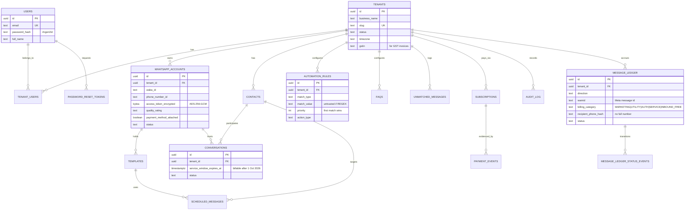
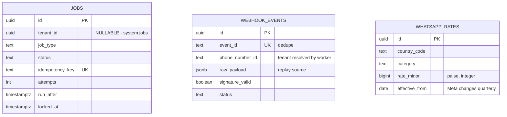

# ER Diagram

## Tables outside the tenant graph

These have no `tenant_id` and sit deliberately outside the diagram above:

**Why they're separate:**
- `jobs` — infrastructure, spans tenants, some jobs are system-level
- `webhook_events` — at ingest we have only a `phone_number_id`; tenant resolution is the
  worker's job. **Never expose through a tenant-facing API.**
- `whatsapp_rates` — global reference data from Meta's published rate card

See `MULTI-TENANT-DATABASE-RULES.md` for the full explanation of these three exceptions.
