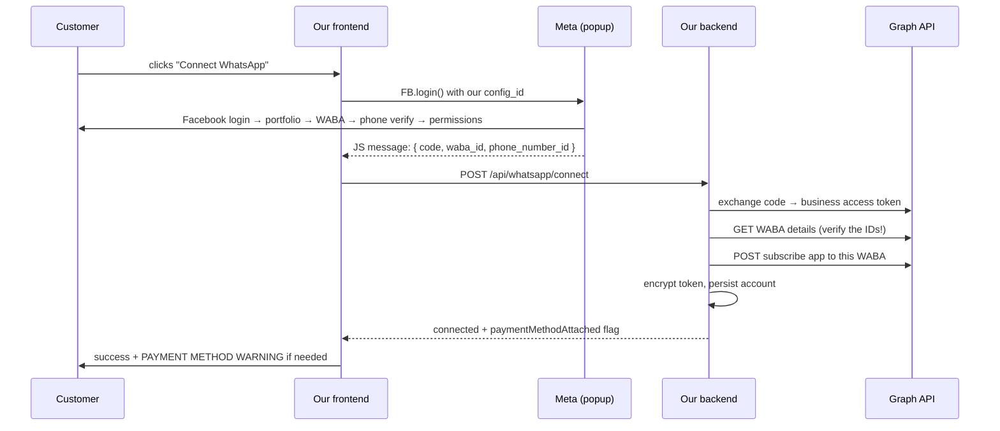

# Embedded Signup

**Classification: BUILD NOW (F06 backend, F18 frontend).**

## What it is

A Meta-hosted popup, launched from your frontend, in which a customer creates or selects their
own WhatsApp Business Account and grants your app access to it. On completion it hands your
browser an **exchangeable code** plus session info (WABA ID, phone number ID).

Assets created this way are **owned by the customer**. They keep full WhatsApp Manager access,
and you cannot restrict it.

## The flow



## Frontend

```javascript
// Load Meta's SDK, then:
FB.login(callback, {
  config_id: import.meta.env.VITE_META_CONFIG_ID,
  response_type: 'code',
  override_default_response_type: true,
  extras: { setup: {}, featureType: '', sessionInfoVersion: '3' }
});
```

Meta also posts session info via `window.addEventListener('message', ...)` — that's where the
WABA ID and phone number ID arrive. Listen for both the login callback and the message event;
you need data from each.

**Handle abandonment.** Customers close the popup, get stuck at phone verification, or fail
Facebook login. This happens often. Do not leave the UI in a spinner — detect the closed popup
and show a "resume" path.

## Backend — the four calls

```java
@Transactional
public WhatsAppAccount connect(ConnectRequest req) {
    UUID tenantId = TenantContext.require();

    // 1. code → business token, scoped to the customer's WABA
    String token = graphClient.exchangeCodeForToken(req.code());

    // 2. VERIFY the IDs against Meta — never trust the client
    WabaDetails waba = graphClient.getWabaDetails(req.wabaId(), token);
    PhoneNumberDetails phone = graphClient.getPhoneNumber(req.phoneNumberId(), token);

    // 3. subscribe OUR app to THIS WABA — without this, no webhooks arrive
    graphClient.subscribeAppToWaba(req.wabaId(), token);

    // 4. persist, token encrypted, upsert on (tenant_id, phone_number_id)
    return accountService.upsert(tenantId, waba, phone, cipher.encrypt(token));
}
```

**Why step 2 is not optional:** the client supplies the IDs, and a malicious client could supply
someone else's. Fetching them with the token you just received proves the token actually grants
access to those assets.

**Why step 3 is the classic bug:** configuring the webhook URL on your App is *not* the same as
subscribing to a specific customer's WABA. Both are required. Miss the second and everything
looks fine until no messages ever arrive.

## What to store

| Field | Source |
|---|---|
| `waba_id` | Session info, verified via Graph |
| `phone_number_id` | Session info, verified via Graph |
| `display_phone_number` | Graph |
| `verified_name` | Graph |
| `quality_rating` | Graph — surface in UI, customers care |
| `messaging_limit_tier` | Graph — new WABAs start low |
| `access_token_encrypted` | Code exchange, AES-256-GCM |

## Idempotency

Upsert on `(tenant_id, phone_number_id)`. A customer reconnecting — after a token revocation, or
just clicking twice — must update the existing row, not create a duplicate.

## The payment-method problem

**This is the most common real-world failure in the Tech Provider model.**

After Embedded Signup completes, the customer must add a payment method to their WABA in
WhatsApp Manager. Meta bills them directly (ADR-005). Without it, sends fail.

Meta provides no clean API flag for this. Practical approach:

1. **Warn prominently at onboarding**, before any send is attempted. Plain language: *"Meta will
   charge you directly for messages. Add a payment method in WhatsApp Manager or your messages
   won't send."* With a link.
2. Infer from payment-related send failures and set `payment_method_attached = false`
3. For your first 20 customers, **watch them do it on a call**

The warning is what prevents the problem. The flag is just for surfacing it later.

## Existing WhatsApp Business app numbers

Many Indian SMBs already use the WhatsApp Business app on the number they'd want to connect.
Meta supports this, but the Embedded Signup flow must be customised for it, and Coexistence has
its own behaviour.

**This is `[DECISION REQUIRED]` D-07.** Ask in validation calls. If most of your prospects are
already on the Business app, this becomes a Phase B requirement rather than an edge case.

Also note: WABAs originally created via a developer app **cannot** be selected through Embedded
Signup.

## Test cases

| Test | Expect |
|---|---|
| Happy path | Token encrypted, webhooks subscribed, account persisted |
| Reconnect same number | Updates, no duplicate |
| Client sends a WABA the token can't access | Rejected |
| Popup abandoned | UI recovers, no partial DB state |
| Token exchange fails | Clear error, nothing persisted (transaction rolls back) |
| Subscribe call fails | Whole connect fails — do not persist a half-connected account |
| Error 200 | Clear message that this is our configuration issue |
| Token absent from logs and response | Assert both |
