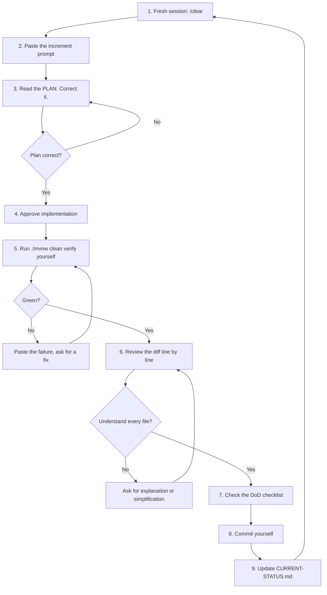

# The Per-Increment Loop

Repeat this for all 23 increments. It's deliberately boring — the discipline is the point.

---

## The nine steps

**1. Fresh session.** Desktop: **New session** from the sidebar (not `/clear` — a new session
gives you a per-increment history you can revisit). CLI: `/clear`. Stale context is where Claude
starts contradicting decisions from three increments ago.

⚠️ **One session at a time on this project.** The desktop app supports parallel sessions in
separate Git worktrees, but the 23 increments are a dependency chain. Two sessions will produce
conflicting Flyway migrations and contradictory module decisions.

**2. Paste the prompt** from the relevant `PROMPTS/` file. Don't paraphrase it — the
constraints and doc references are load-bearing.

Faster on desktop: open **BUILD-LOG.html**, click the `@` chips for that increment to copy the
doc paths, and let `@` autocomplete pull the files in rather than opening them yourself.

**3. Read the plan.** Every prompt ends with "plan first, don't write code yet." Actually
read it. Look specifically for: a new dependency you didn't approve, a missing `tenant_id`,
a synchronous WhatsApp call, work that belongs in a later increment.

**4. Approve.** "Plan looks right, implement it." Or correct it and re-plan. Correcting a
plan is one message; correcting 600 lines is an hour.

**5. Run the build yourself.** Don't take "all tests pass" on trust. `./mvnw clean verify`.

**6. Review the diff.** Desktop: click the `+12 -1` change indicator for file-by-file review with
line-level comments. CLI: `git diff`. If you can't explain what a file does, you have a
problem now, not later. Ask: "explain why X is needed" or "this seems over-built, simplify".

**7. Check the DoD.** Every increment prompt has a Definition of Done. Tick it off literally.

**8. Commit yourself.** `git add -p` if the change is mixed. Conventional commit message:
`feat(whatsapp): embedded signup callback and token exchange`.

**9. Update `CURRENT-STATUS.md`** and tick the step in **BUILD-LOG.html**. Ten seconds now saves
twenty minutes after a break.

---

## When it goes wrong

| Symptom | Do this |
|---|---|
| Ignoring a `CLAUDE.md` rule | Run `/memory` — confirm the file is loaded. Then quote the rule back explicitly in your message. |
| Added Redis/Kafka/a new dependency | "Remove that. Rule 9 in CLAUDE.md. Solve it with Postgres." |
| Sprawling beyond the increment | "Stop. That's increment F16. Revert those files, finish F13 only." |
| Confidently wrong about a Spring API | Append `use context7`, or paste the actual doc snippet. |
| Losing the thread in a long session | Start a new session and restate with the increment prompt. Don't fight a polluted context. |
| Can't find the right doc | Open **BUILD-LOG.html** → All docs tab → filter → click to copy the `@` mention |
| Tests pass but behaviour is wrong | The test is probably asserting the implementation, not the requirement. Ask for a test written from the DoD instead. |
| Suggests skipping tenant-isolation tests | Never accept this. It's the one category of bug that ends the business. |

---

## Session hygiene

- **One increment per session.** Two is where quality drops.
- **Don't let it commit.** You commit. That's your review gate.
- **Keep `CLAUDE.md` current.** When a convention changes, update the file, not just the chat.
- **Prefer questions over guesses.** If Claude asks a product question, the answer belongs
  in `13-DECISIONS/DECISIONS.md` — not just in the chat where it'll be lost.
- **Stop at green.** When the DoD is met, stop. The urge to "just also add..." is how
  10 weeks becomes 20.
